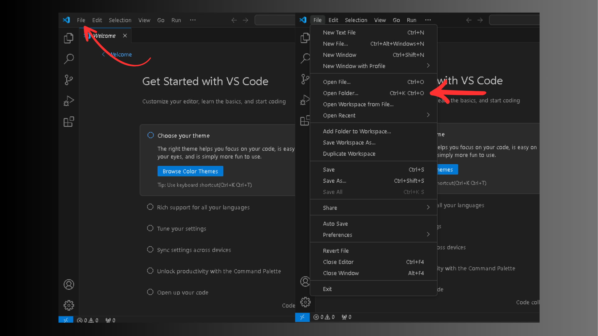
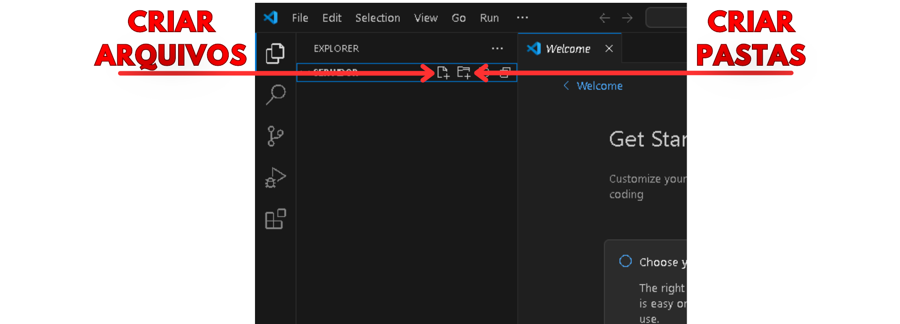
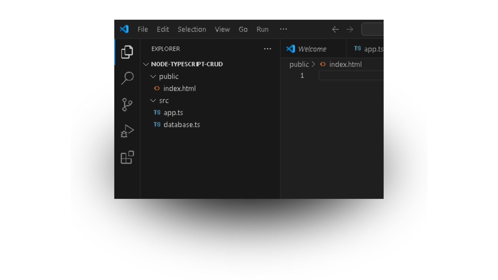
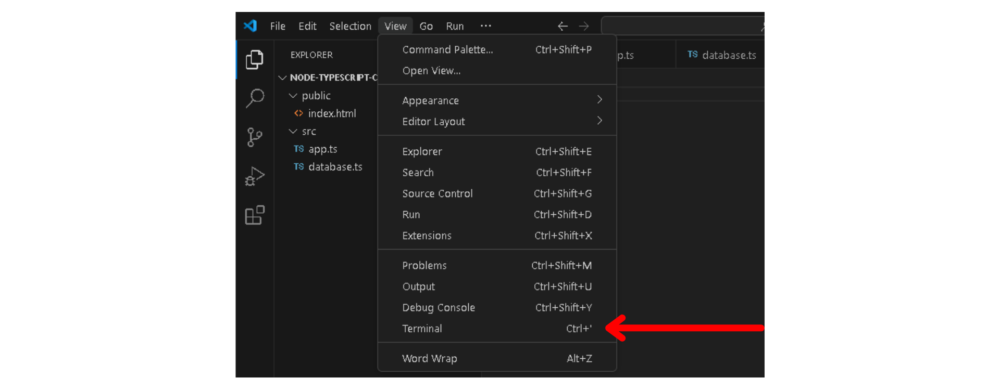
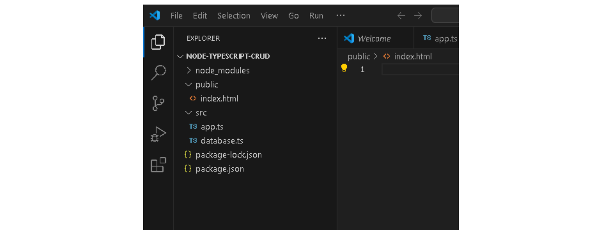
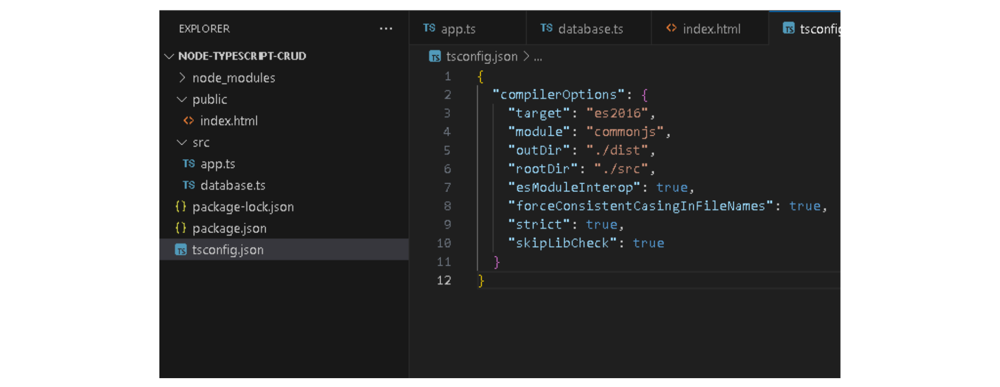
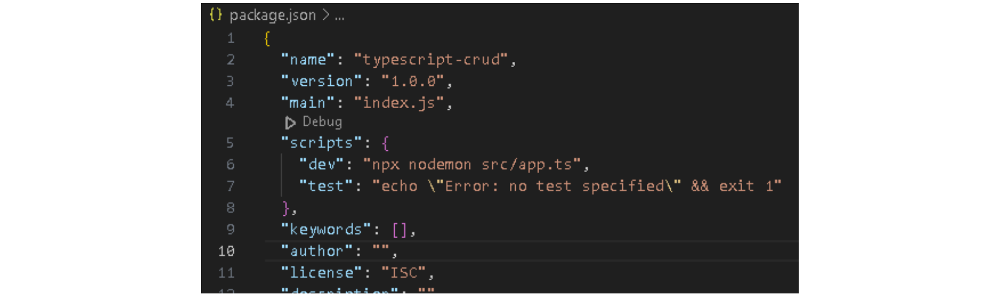
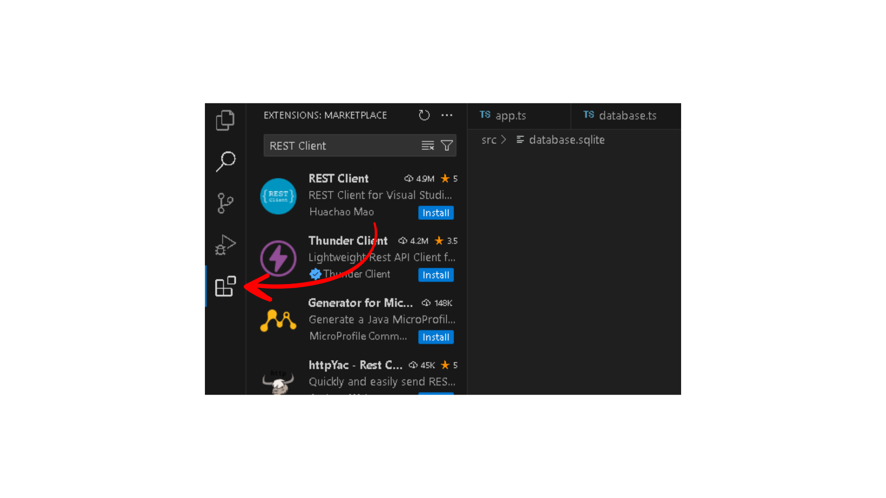
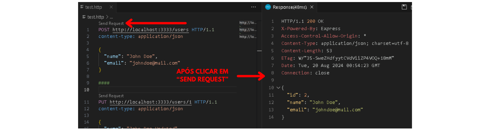

---

# Projeto Node.js com TypeScript - CRUD de Usuários

Este guia irá ajudá-lo(a) a configurar e executar um projeto Node.js com TypeScript, criando um servidor Express com um CRUD básico de usuários utilizando um banco de dados SQLite.

## Sumário

1. [Pré-requisitos](#1-pré-requisitos)
2. [Configurando o Ambiente de Desenvolvimento](#2-configurando-o-ambiente-de-desenvolvimento)
3. [Iniciando o Projeto Node.js](#3-iniciando-o-projeto-nodejs)
4. [Configurando o TypeScript](#4-configurando-o-typescript)
5. [Configurando o Servidor Express](#5-configurando-o-servidor-express)
6. [Configurando o Banco de Dados SQLite](#6-configurando-o-banco-de-dados-sqlite)
7. [Criando a Interface HTML](#7-criando-a-interface-html)
8. [Rodando o Servidor](#8-rodando-o-servidor)
9. [Estrutura de Pastas](#9-estrutura-de-pastas)
10. [Testando o Projeto](#10-testando-o-projeto)
11. [Tratando Erros Comuns](#11-tratando-erros-comuns)

---

## 1. Pré-requisitos

Antes de iniciar, certifique-se de que você possui o Node.js e o Visual Studio Code instalados em seu sistema.

### Verificando a instalação do Node.js

Abra o CMD no Windows ou o Terminal no Linux e digite:

```bash
node -v
```

Se o Node.js não estiver instalado, [clique aqui para baixar e instalar](https://nodejs.org/).

### Verificando a instalação do Visual Studio Code

Digite `code .` no terminal ou pesquise por "Visual Studio Code" na barra de pesquisa do sistema operacional. Se o Visual Studio Code abrir, significa que ele já está instalado. Caso contrário, você pode baixar o Visual Studio Code [aqui](https://code.visualstudio.com/).

## 2. Configurando o Ambiente de Desenvolvimento

### Criando o diretório do projeto

1. **No Windows ou Mac**: Na área de trabalho, clique com o botão direito do mouse, selecione **Nova Pasta** e nomeie-a como `node-typescript-crud`.
   
   **No Linux**:
   - Se você puder criar a pasta na área de trabalho via interface gráfica, clique com o botão direito do mouse, selecione **Nova Pasta** e nomeie-a como `node-typescript-crud`.
   - **Se você não conseguir criar a pasta na área de trabalho via interface gráfica**: Use o terminal para garantir que funcione independentemente do idioma do sistema. Execute o seguinte comando para criar a pasta na área de trabalho:
     ```bash
     mkdir ~/$(xdg-user-dir DESKTOP)/node-typescript-crud
     ```

2. Abra o Visual Studio Code. Você pode abrir a pasta criada de duas maneiras:
   - Clique em **File > Open Folder** e selecione a pasta criada.
   - Ou use o atalho `Ctrl + K + O` para abrir a janela de seleção de pastas e escolha a pasta criada.



### Criando os arquivos iniciais

1. No Visual Studio Code, crie uma pasta chamada `src` dentro do seu projeto.
2. Dentro da pasta `src`, crie dois arquivos: `app.ts` e `database.ts`.
3. Crie também uma pasta chamada `public` na raiz do projeto. Dentro dela, crie um arquivo chamado `index.html`.

**Nota:** Futuramente, quando estiver acrescentando códigos nos arquivos, para salvar e atualizar os códigos existentes, use o atalho `Ctrl + S` enquanto estiver editando o arquivo.



**Nota:** Confira seu projeto no VS Code e veja se a estrutura de arquivos e pastas está como na imagem a seguir.



## 3. Iniciando o Projeto Node.js

Para iniciar o projeto, você precisará abrir o terminal integrado no Visual Studio Code. Você pode fazer isso de duas maneiras:

1. **Usando o atalho de teclado**: Pressione `Ctrl + '` para abrir o terminal integrado.

2. **Abrindo manualmente**: Você pode abrir o terminal manualmente clicando em **View > Terminal** na barra de menus superior.



Depois de abrir o terminal, copie o comando a seguir clicando no ícone de cópia no canto superior direito do bloco de código (ícone de dois quadrados sobrepostos). Em seguida, cole o comando no terminal e pressione Enter para executá-lo. Este comando irá iniciar o projeto Node.js:

```bash
npm init -y
```

---

Instale as dependências necessárias:

```bash
npm install express cors sqlite3 sqlite
npm install --save-dev typescript nodemon ts-node @types/express @types/cors
```

### Aviso Importante:

Após a execução dos comandos acima, será criada uma pasta chamada `node_modules` e um arquivo chamado `package-lock.json` no diretório do seu projeto. A pasta `node_modules` contém todos os pacotes e dependências instaladas, e o arquivo `package-lock.json` ajuda a gerenciar as versões dessas dependências.

Se você encontrar algum erro ao executar esses comandos no terminal, consulte o Capítulo 11, onde são abordados erros comuns e como resolvê-los.

A seguir, veja uma imagem que demonstra como deve ficar a estrutura dos seus diretórios após a execução desses comandos:



## 4. Configurando o TypeScript

Para configurar o TypeScript no seu projeto, siga os passos abaixo:

1. Abra o terminal integrado no Visual Studio Code.
2. Execute o seguinte comando para inicializar o TypeScript no projeto:

   ```bash
   npx tsc --init
   ```

3. Após executar o comando acima, um arquivo chamado `tsconfig.json` será gerado no diretório do seu projeto. Agora, você precisa substituir o conteúdo desse arquivo com a configuração adequada:

   - **Abra o arquivo `tsconfig.json`** no Visual Studio Code.
   - **Pressione `Ctrl + A`** para selecionar todo o conteúdo do arquivo.
   - **Pressione `Backspace`** para apagar o conteúdo selecionado.
   - **Pressione `Ctrl + V`** para colar o código abaixo:


   ```json
   {
     "compilerOptions": {
       "target": "es2016",
       "module": "commonjs",
       "outDir": "./dist",
       "rootDir": "./src",
       "esModuleInterop": true,
       "forceConsistentCasingInFileNames": true,
       "strict": true,
       "skipLibCheck": true
     }
   }
   ```

4. Pressione Ctrl + S para salvar as alterações feitas no arquivo `tsconfig.json`.
5. Após fazer essas alterações, o TypeScript estará configurado para compilar os arquivos da pasta `src` e colocar os arquivos JavaScript resultantes na pasta `dist`. A seguir, veja uma imagem que demonstra como deve ficar o código e a estrutura dos seus diretórios após as alterações feitas.



## 5. Configurando o Servidor Express

Antes de configurar o servidor, você precisa conferir se existe o comando `dev` no `package.json` para rodar o servidor com o comando `npm run dev`.

### Conferindo o script `dev` no `package.json`

1. Abra o arquivo `package.json` no Visual Studio Code.
2. Localize a seção `"scripts": { ... }`.
3. Veja se existe o comando `dev`. Caso ele não esteja presente, adicione a seguinte linha dentro da seção `"scripts"`, clique ao lado do `{`, pressione Enter para ir para a linha de baixo e cole o trecho:

   ```json
     "dev": "npx nodemon src/app.ts",
   ```
   Após isso, a seção `"scripts"` deve ficar assim:

   ```json
   "scripts": {
     "dev": "npx nodemon src/app.ts",
     "test": "echo \"Error: no test specified\" && exit 1"
   }
   ```

4. Pressione `Ctrl + S` para salvar as alterações feitas no arquivo `package.json`.

Confira a imagem a seguir para ver se a estrutura do `package.json` está correta:



### Configurando o Servidor Express

No arquivo `src/app.ts`, adicione o código a seguir para configurar o servidor. Depois, pressione `Ctrl + S` para salvar as alterações feitas no arquivo.

```typescript
import express from 'express'
import cors from 'cors'
import { connect } from './database'

const port = 3333
const app = express()

app.use(cors())
app.use(express.json())
app.use(express.static(__dirname + '/../public'))

app.get('/users', async (req, res) => {
  console.log('GET /users request received');
  const db = await connect()
  const users = await db.all('SELECT * FROM users')
  console.log('Users fetched:', users);
  res.json(users)
})

app.post('/users', async (req, res)

 => {
  console.log('POST /users request received:', req.body);
  const db = await connect()
  const { name, email } = req.body
  const result = await db.run('INSERT INTO users (name, email) VALUES (?, ?)', [name, email])
  console.log('User inserted with ID:', result.lastID);
  const user = await db.get('SELECT * FROM users WHERE id = ?', [result.lastID])
  console.log('New user fetched:', user);
  res.json(user)
})

app.put('/users/:id', async (req, res) => {
  console.log('PUT /users/:id request received:', req.body, req.params.id);
  const db = await connect()
  const { name, email } = req.body
  const { id } = req.params
  await db.run('UPDATE users SET name = ?, email = ? WHERE id = ?', [name, email, id])

  const user = await db.get('SELECT * FROM users WHERE id = ?', [id])

  if (user) {
    console.log('Updated user fetched:', user);
    res.json(user)
  } else {
    console.log('User not found after update:', id);
    res.status(404).json({ message: 'User not found' })
  }
})


app.delete('/users/:id', async (req, res) => {
  console.log('DELETE /users/:id request received:', req.params.id);
  const db = await connect()
  const { id } = req.params
  await db.run('DELETE FROM users WHERE id = ?', [id])
  console.log('User deleted with ID:', id);
  res.json({ message: 'User deleted' })
})

app.listen(port, () => {
  console.log(`Server running on port ${port}`)
})
```

## 6. Configurando o Banco de Dados SQLite

### Criando o arquivo de banco de dados

No arquivo `src/database.ts`, adicione o seguinte código para configurar o banco de dados SQLite (lembre-se de executar o comando `Ctrl + S` após colar o código para salvar o arquivo):

```typescript
import { open, Database } from 'sqlite';
import sqlite3 from 'sqlite3';

let instance: Database | null = null;

export async function connect() {
  if (instance !== null) return instance;

  const db = await open({
     filename: './src/database.sqlite',
     driver: sqlite3.Database
   });
  
  await db.exec(`
    CREATE TABLE IF NOT EXISTS users (
      id INTEGER PRIMARY KEY AUTOINCREMENT,
      name TEXT,
      email TEXT
    )
  `);

  instance = db;
  return db;
}
```

## 7. Criando a Interface HTML

Vamos agora criar uma interface HTML para interagir com a API.

### Criando o arquivo HTML

1. Dentro da pasta `public`, no arquivo `index.html`, adicione o seguinte código HTML (lembre-se de executar o comando `Ctrl + S` após colar o código para salvar o arquivo):

```html
<!DOCTYPE html>
<html lang="en">

<head>
  <meta charset="UTF-8">
  <meta name="viewport" content="width=device-width, initial-scale=1.0">
  <title>CRUD de Usuários</title>
</head>

<body>
  <form>
    <input type="text" name="name" placeholder="Nome" required>
    <input type="email" name="email" placeholder="Email" required>
    <button type="submit">Cadastrar</button>
  </form>

  <table>
    <thead>
      <tr>
        <th>Id</th>
        <th>Nome</th>
        <th>Email</th>
        <th>Ações</th>
      </tr>
    </thead>
    <tbody>
      <!-- Os dados serão inseridos aqui -->
    </tbody>
  </table>

  <script>
    const form = document.querySelector('form')

    form.addEventListener('submit', async (event) => {
      event.preventDefault()

      const name = form.name.value
      const email = form.email.value

      await fetch('/users', {
        method: 'POST',
        headers: { 'Content-Type': 'application/json' },
        body: JSON.stringify({ name, email })
      })

      form.reset()
      fetchData()
    })

    const tbody = document.querySelector('tbody')

    async function fetchData() {
      const resp = await fetch('/users')
      const data = await resp.json()

      tbody.innerHTML = ''

      data.forEach(user => {
        const tr = document.createElement('tr')
        tr.innerHTML = `
          <td>${user.id}</td>
          <td>${user.name}</td>
          <td>${user.email}</td>
          <td>
            <button class="excluir">Excluir</button>
            <button class="editar">Editar</button>
          </td>
        `

        const btExcluir = tr.querySelector('button.excluir')
        const btEditar = tr.querySelector('button.editar')

        btExcluir.addEventListener('click', async () => {
          await fetch(`/users/${user.id}`, { method: 'DELETE' })
          tr.remove()
        })

        btEditar.addEventListener('click', async () => {
          const name = prompt('Novo nome:', user.name)
          const email = prompt('Novo email:', user.email)

          await fetch(`/users/${user.id}`, {
            method: 'PUT',
            headers: { 'Content-Type': 'application/json' },
            body: JSON.stringify({ name, email })
          })

          fetchData()
        })

        tbody.appendChild(tr)
      })
    }

    fetchData()
  </script>
</body>

</html>
```

## 8. Rodando o Servidor

Com a interface HTML pronta e o servidor configurado, é hora de rodar o servidor para testar o projeto.

### Iniciando o Servidor

1. Abra o terminal integrado no Visual Studio Code.
2. Execute o seguinte comando para iniciar o servidor:

   ```bash
   npm run dev
   ```

3. Se o servidor for iniciado corretamente, você verá uma mensagem no terminal como esta:

   ```
   Server running on port 3333
   ```

Isso indica que o servidor está rodando na porta 3333, e agora você pode acessar a interface HTML no navegador.

### Testando a interface HTML

1. **Acesse a interface HTML no navegador**:
   - No seu navegador, abra `http://localhost:3333` para acessar a interface HTML.

2. **Interaja com a interface**:
   - Utilize o formulário para adicionar usuários e veja os dados serem exibidos na tabela abaixo.
   - A interface permite adicionar, editar e excluir usuários diretamente do navegador, interagindo com a API que você configurou.

## 9. Estrutura de Pastas

A estrutura final de pastas do seu projeto deve ficar assim:

```plaintext
node-typescript-crud/
│
├── node_modules/
│   └── ...
├── public/
│   └── index.html
├── src/
│   ├── app.ts
│   └── database.ts
├── package.json
├── package-lock.json
└── tsconfig.json
```

**Nota:** Caso você tenha executado alguma ação no projeto, como cadastrar um usuário, será criado um arquivo `database.sqlite` dentro da pasta `src`. Esse arquivo é utilizado pelo SQLite para armazenar os dados do seu banco de dados.

## 10. Testando o Projeto

### Instalando a extensão REST Client

1. No Visual Studio Code, abra a barra lateral de extensões clicando no ícone de extensões ou utilizando o atalho `Ctrl + Shift + X`.
2. Na barra de pesquisa, digite **REST Client**.
3. Instale a extensão **REST Client** da **Huachao Mao**.



### Testando as rotas

1. Crie um arquivo chamado `test.http` na raiz do seu projeto.
2. No arquivo `test.http`, adicione o seguinte código para testar as rotas de CRUD de usuários (lembre-se de executar o comando `Ctrl + S` após colar o código para salvar o arquivo):

```http
POST http://localhost:3333/users HTTP/1.1
content-type: application/json

{
  "name": "John Doe",
  "email": "johndoe@mail.com"
}

####

PUT http://localhost:3333/users/1 HTTP/1.1
content-type: application/json

{
  "name": "John Doe Updated",
  "email": "johndoe@mail.com"
}

####

DELETE http://localhost:3333/users/1 HTTP/1.1
```

3. Para testar as rotas, clique no botão **Send Request** que aparecerá acima de cada bloco de código no Visual Studio Code.



Se tudo estiver configurado corretamente, você verá as respostas JSON adequadas para cada requisição.

---

## 11. Tratando Erros Comuns

### Erro: `npm : O termo 'npm' não é reconhecido como nome de cmdlet, função, arquivo de script ou programa operável.`

**Descrição**: Esse erro ocorre quando o Node.js (e, portanto, o npm) não está instalado corretamente ou o caminho (PATH) para o npm não está configurado.

**Solução**:

1. **Verifique se o Node.js está instalado**:
   - Abra o terminal e execute:
     ```bash
     node -v
     ```
   - Se não retornar uma versão, o Node.js não está instalado

 corretamente. [Baixe e instale o Node.js](https://nodejs.org/).

2. **Verifique as variáveis de ambiente**:
   - Certifique-se de que o caminho para o npm esteja incluído na variável PATH do sistema.

#### Adicionando o npm ao PATH no Windows

1. **Abra o Painel de Controle**:
   - No Windows, pressione `Win + S` e digite "Painel de Controle" na barra de pesquisa.
   - Clique em **Painel de Controle** para abri-lo.

2. **Acesse o Sistema**:
   - No Painel de Controle, clique em **Sistema e Segurança**.
   - Em seguida, clique em **Sistema**.

3. **Configurações avançadas do sistema**:
   - No lado esquerdo da janela do sistema, clique em **Configurações avançadas do sistema**.
   - Isso abrirá a janela **Propriedades do Sistema** na aba **Avançado**.

4. **Variáveis de Ambiente**:
   - Na aba **Avançado**, clique no botão **Variáveis de Ambiente**.

5. **Escolha onde adicionar o PATH**:
   - **Para adicionar apenas para o usuário atual**: Na seção **Variáveis de usuário para [Seu Nome de Usuário]**, selecione a variável `Path` e clique em **Editar**.
   - **Para adicionar para todos os usuários do sistema**: Na seção **Variáveis de sistema**, selecione a variável `Path` e clique em **Editar**.

6. **Adicione o Caminho do Node.js**:
   - Na janela de edição da variável `Path`, clique em **Novo**.
   - Adicione o caminho do diretório onde o Node.js (e o npm) está instalado. O caminho típico é:
     ```plaintext
     C:\Program Files\nodejs\
     ```
   - Certifique-se de adicionar esse caminho sem remover os outros caminhos existentes na variável `Path`.

7. **Salvar e Reiniciar**:
   - Clique em **OK** para fechar a janela de edição da variável.
   - Clique em **OK** novamente para fechar a janela de Variáveis de Ambiente e mais uma vez para fechar as Propriedades do Sistema.
   - Reinicie o terminal ou o computador para garantir que as mudanças entrem em vigor.

8. **Verifique novamente**:
   - Abra um novo terminal e execute `npm -v` para verificar se o `npm` agora é reconhecido.

### Erro: `Error: Cannot find module 'express'`

**Descrição**: Esse erro ocorre quando você tenta executar o código, mas as dependências necessárias não foram instaladas corretamente.

**Solução**:

1. **Reinstale as dependências**:
   - No terminal, execute:
     ```bash
     npm install
     ```

### Erro de PATH Não Reconhecido

**Descrição**: Esse erro geralmente ocorre quando você tenta executar um comando e o terminal retorna uma mensagem como "command not found" ou "não é reconhecido como um comando interno ou externo".

**Causa**: Isso acontece porque o terminal não consegue encontrar o executável do comando, normalmente porque o diretório onde o executável está localizado não está incluído na variável de ambiente PATH.

**Solução**:

1. **No Windows**:
   - Verifique se o Node.js está instalado corretamente e se foi incluído no PATH durante a instalação.
   - Abra as "Configurações do Sistema" > "Variáveis de Ambiente" e adicione o caminho do Node.js à variável PATH.

2. **No Linux**:
   - Verifique se o Node.js está instalado e se o caminho do Node.js está no PATH.
   - Adicione o caminho do Node.js ao PATH no arquivo `.bashrc` ou `.zshrc`:
     ```bash
     export PATH=$PATH:/caminho/para/nodejs
     ```
   - Execute `source ~/.bashrc` para aplicar as mudanças.

### Outros Erros Comuns

- **SyntaxError**: Erros de sintaxe podem ocorrer por causa de erros de digitação ou formatação incorreta. Revise o código para encontrar e corrigir a sintaxe incorreta.
- **TypeError**: Esse erro ocorre quando você tenta realizar uma operação em um valor do tipo errado, como chamar uma função em uma variável que não é uma função.
- **UnhandledPromiseRejectionWarning**: Este erro aparece quando uma promessa (Promise) é rejeitada sem tratamento. Certifique-se de usar `try/catch` ou `.catch` para capturar erros de promessas.

### Logs de Erros e Depuração

Quando você encontrar erros, o Node.js geralmente fornece logs detalhados no terminal. Aqui estão algumas dicas para interpretar e usar esses logs:

- **Stack Trace**: O erro geralmente inclui um "stack trace" que mostra onde no código o erro ocorreu. Use essa informação para identificar o arquivo e a linha de código problemáticos.
- **Mensagens de Erro**: Leia atentamente a mensagem de erro; ela frequentemente sugere a causa do problema (exemplo: um módulo faltando, um erro de sintaxe, etc.).
- **Google e Stack Overflow**: Copie e cole a mensagem de erro (ou parte dela) no Google ou no Stack Overflow. Muitas vezes, outras pessoas já enfrentaram problemas semelhantes e você pode encontrar uma solução rápida.

### Recursos e Ferramentas para Resolução de Problemas

Se você encontrar um erro e não souber como resolvê-lo, existem diversos recursos online e ferramentas que podem ajudá-lo.

#### Sites Úteis para Pesquisar Erros

1. **[Stack Overflow](https://stackoverflow.com/)**: Um dos maiores repositórios de perguntas e respostas sobre programação. Pesquise pelo erro específico que você está enfrentando; é provável que alguém já tenha encontrado e resolvido o mesmo problema.
2. **[GitHub Issues](https://github.com/issues)**: Se você estiver usando uma biblioteca de código aberto, consulte as issues no repositório do GitHub. Muitas vezes, erros conhecidos já foram relatados e possivelmente solucionados.
3. **[MDN Web Docs](https://developer.mozilla.org/)**: Documentação extensa sobre JavaScript e tecnologias relacionadas. Pode ser útil para entender melhor erros específicos de JavaScript.

#### Inteligências Artificiais para Suporte

1. **[ChatGPT](https://openai.com/chatgpt)**: Desenvolvido pela OpenAI, ChatGPT pode ajudar a explicar conceitos, sugerir soluções para problemas de código e fornecer exemplos de código.
2. **[Claude](https://claude.ai/)**: Uma IA da Anthropic, Claude é útil para consultas de código, correções, e é destacada nos benchmarks por suas excelentes capacidades em programação, oferecendo explicações técnicas e auxílio em problemas de programação.
3. **[Gemini](https://gemini.google.com/)**: Desenvolvido pelo Google, Gemini é uma IA que pode ser usada para suporte técnico em programação e outras tarefas técnicas.

Essas IAs são ferramentas que podem acelerar a resolução de problemas, oferecendo suporte personalizado e respostas rápidas para suas dúvidas.

---
